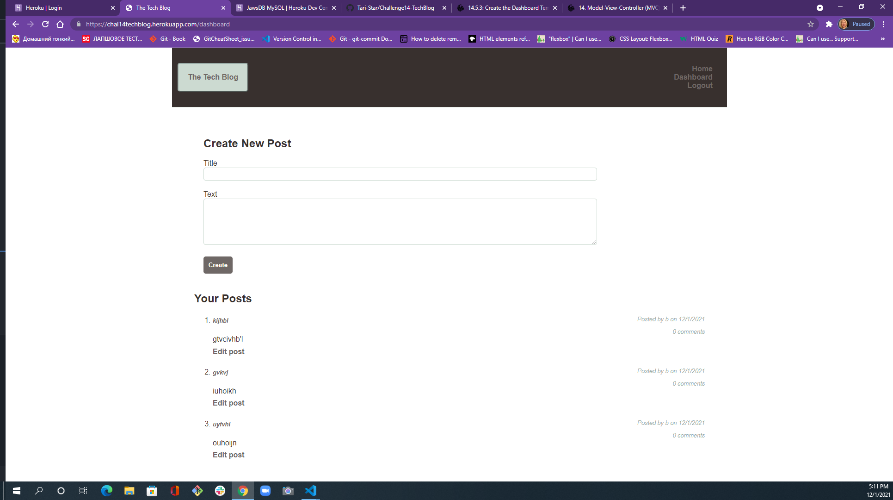

# Challenge14-TechBlog

## Description:
 
 CMS-style blog site, where developers can publish their blog posts and comment on other developers’ posts as well. The app follows the MVC paradigm in its architectural structure, using Handlebars.js as the templating language, Sequelize as the ORM, and the express-session npm package for authentication.

##  Table of Contents

* [Demo](#demo)
* [Technology](#technology)
* [Usage](#usage)
* [License](#license)
* [Questions](#questions)

***HEROKU***

* Deployed link:  [https://chal14techblog.herokuapp.com/](https://chal14techblog.herokuapp.com/)

***GITHUB***

* Repository link: [https://github.com/Tari-Star/Challenge14-TechBlog.git](https://github.com/Tari-Star/Challenge14-TechBlog.git)

## Demo:

 ## Technology ( Links ):

**1. [Node.js ](https://nodejs.org/en/):**

* Node.js is an open-source and cross-platform JavaScript runtime environment. 

**2. [Express.js](https://expressjs.com/):**

* Web Applications : Express is a minimal and flexible Node.js web application framework that provides a robust set of features for web and mobile applications.

**3. [Sequelize](https://www.npmjs.com/package/sequelize):**

* Sequelize is a promise-based Node.js ORM tool for Postgres, MySQL, MariaDB, SQLite and Microsoft SQL Server.

**4. [MySQL2](https://www.npmjs.com/package/mysql2):**

* MySQL client for Node.js with focus on performance.

* MySQL2 is mostly API compatible with mysqljs and supports majority of features.

**5. [Dotenv](https://www.npmjs.com/package/dotenv):**

* Dotenv is a zero-dependency module that loads environment variables from a .env file into process.env.

**6. [Express-Handlebars](https://www.npmjs.com/package/express-handlebars):**

* Handlebars. js is a templating engine similar to the ejs module in node. ... HandleBars can be used to render web pages to the client side from data on the server-side.

**7. [Express-session](https://www.npmjs.com/package/express-session):**

* Express-session - an HTTP server-side framework used to create and manage a session middleware. 

**8. [Bcrypt package](https://www.npmjs.com/package/bcrypt):**

* The bcrypt NPM package is a JavaScript implementation of the bcrypt password hashing function that allows you to easily create a hash out of a password string .

**9. [Connect-session-sequelize](https://www.npmjs.com/package/connect-session-sequelize):**

* Connect-session-sequelize is a SQL session store using Sequelize.js.

**10. [Heroku](https://www.heroku.com/):**

* Heroku is a container-based cloud Platform as a Service (PaaS).Developers use Heroku to deploy, manage, and scale modern apps.

 ## Usage:

***To install necessary dependencies, run the following command in your terminal :***

* Clone repository to use this application on your local machine.
* To install *node.js*, run  `npm i`.
* To install *express*, run `npm i express`.
* To install *sequelize*, run `npm i sequelize`.
* To install *mysql2*, run `npm i mysql2`.
* To install *dotenv*, run `npm i dotenv`.
* To install *express-handlebars*, run `npm i    express-handlebars`.
* To install *express-session*, run `npm i express-session`.
* To install *connect-session-sequelize*, run `npm i connect-session-sequelize`.
* To install *bcrypt*, run `npm i bcrypt`.

* Run `npm run seed` to seed data to your database so that you can test your routes.

* To deploy on *heroku*, run `heroku create <app-name>`.

 ## License

    
***This project is licensed under the [MIT license](https://choosealicense.com/licenses/mit)***
    
---
   
 ## Questions?

   
  
  
  For any questions about the repo, please contact me with the information below :
  ---
  
 ***To open an issue :***
 
 GitHub/Issues: [@Tari-Star](https://github.com/Tari-Star/Challenge14-TechBlog/issues)

 ***Contact me directly :***
  
 Email: [tari.star.g@gmail.com](mailto:tari.star.g@gmail.com)